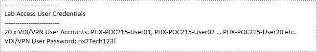
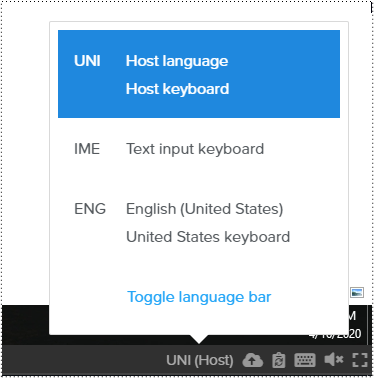
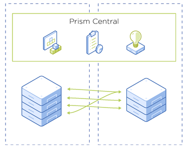
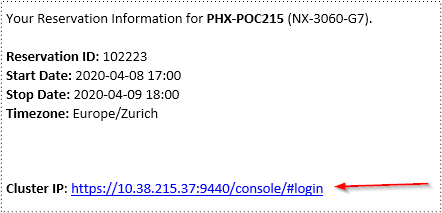
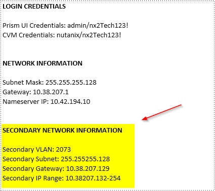
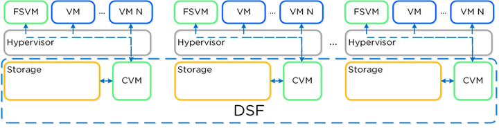
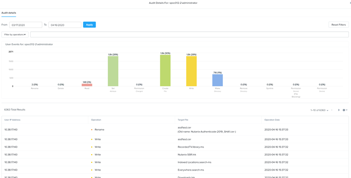

.. _Nutanix_Workshop_Bootcamp:

.. role::   raw-html(raw)
      :format: html

+-------------------------------------------------------------------------+
|                                                                         |                                                                    
|  |image9|                                                               |
|                                                                         |
+-------------------------------------------------------------------------+

*Resources Nutanix*

Connection instruction
========================================

In order to have the best user experience, we greatly encourage you to use the **Chrome Web Browser.**

Everyone participating to this workshop will receive:

-  | **Nutanix Labs Reservation document.**
   | In the **LAB_DOCUMENT.DOC** file you’ll find your POC number and
     all personnel information related to your **HPOC**. Please remember
     to write down your POC number. Each time you’ll see POCxxx in this
     document, you’ll have to **replace** the information with your POC
     information. In this example, it would be PHX-POC215

-  **The common information** **(This Web Guide)** shared resources
   needed for the workshop, often described as “information given by the
   instructor”. These informations will be :

+-------------------------------------------------+---------------------------------+
| Prism Central IP Address                        | **in your HPOC document**       |
+-------------------------------------------------+---------------------------------+
| Prism Central username                          | **admin**                       |
+-------------------------------------------------+---------------------------------+
| Prism Central Password                          | **nx2Tech123!**                 |
+-------------------------------------------------+---------------------------------+
| Active Directory Name Server IP Addresses       | **10.55.15.45 and 10.55.15.46** |
+-------------------------------------------------+---------------------------------+
| Active Directory Domain Name                    | **RTP-POC015.nutanix.local**    |
+-------------------------------------------------+---------------------------------+   
| Active Directory Username                       | **administrator**               |
+-------------------------------------------------+---------------------------------+   
| Active Directory Password                       | **nx2Tech123!**                 |
+-------------------------------------------------+---------------------------------+   

**Connect to the Nutanix Frame Hosted Desktop**

In order to manage the Nutanix environment, you’ll need to access your
Jumphost. To do so, use the Chrome Web browser, go to this address :
**https://frame.nutanix.com/x/labs/**

In the middle of the Nutanix Labs Reservation document, you’ll find a
VDI username and password, to connect to the Jumphost. Please take one
of the following, corresponding to your HPOC. See below an exemple :

|image1|

Attention, once connected to the virtual desktop, you should change the
language input to match your current keyboard by clicking on the
bottom-right corner, and selecting UNI (Host language) as in the below
screenshot

|image2|

Image Repository
================

| All ISO file needed for this HPOC can be found at this address :
| http://10.42.194.11/images/ (PHX) or http://10.55.251.38/images (RTP)

..

You’ll be able to access it from the Jumphost Chrome browser, and then
copy the URL of the needed ISO file. As the content of this repository
is often updated, some minor changes can be seen regarding folder name
or file name.

POC Guidance
============

|image3|

You’ll see that the majority of management operations can be done with
Prism Central, which will allow you to manage multiple Nutanix Clusters
from the same interface, and the majority of the Nutanix Product
ecosystem such as :

   -  Nutanix **AHV**
   -  Nutanix **Karbon**
   -  Nutanix **Calm**
   -  Nutanix **Object**
   -  Nutanix **Flow**
   -  Nutanix **Leap**
   -  ….

But we still have the possibility to manage some specific settings at
Prism Element level (mainly related to HCI configuration, and Nutanix
Files). This workshop will guide you through both interfaces, to get you
comfortable to work with both options.

As a reminder, please use **Google Chrome** within the VDI Jumphost for
the entire workshop.

Getting started with the Prism interface
========================================

   -  To connect to the Prism interface, log on to the cluster IP address
      or to the IP address of one of the CVM controllers. You can find your
      cluster IP address in the Lab information document close to the top

|

   -  |image4|

|

   -  Once connected with the username / password provided below the IP
      address (use the Prism UI credentials), click on "Home" on the
      top-left menu, and then look through each section.

Please remember your POC number is easily identifiable on the top-left
section of the Prism console.

In order to be able to install an OS into a newly deployed VM, we will
need to upload the OS installation ISO file to Prism Element (shortened
by PE).

HPOC Workaround
===============

As we used a customer deployed Active Directory for this LAB, which is
in a different network, not known by our global DNS server, we need to
enter a new DNS Server entry on PE. Please proceed as below:

   -  Click on the Gear icon on the top right / Name Server

   -  Delete the existing DNS entry

   -  Add the two Active Directory Name Server IP addresses given by the instructor

Add an ISO image file to Prism Element
======================================

In order to manage an ISO file to install guest OS, ISO file should be
uploaded to PE (Prism Element), to quickly use it when you want to
install a guest OS. It allows you to have a central repository
available. Once connected to Prism Central, these images can be managed
from there. In this lab, we’ll do the full guest os installation setup.

1. Open a second tab on Chrome on your Jump Host, and retrieve the
   Windows 2016 URL by navigating with Chrome to http://10.42.194.11 ->
   Image -> Windows -> Windows Server 2016 -> ISO. Copy the full URL
   path of one of the ISO files (you can take the image with the longest
   name).

2. Go back to Nutanix PE Tab, click on the gear icon located on the
   top-right. Go to settings / general / image configuration

3. Click on + Upload Image, provide a name, Images container, and
   provide the source Image URL as below, **change the Image Type to ISO**. 
   Put a name like Windows 2016 ISO.

..

.. note::
   **There is a small cosmetic bug, you need to change the image type to ISO once you’ve entered an URL**

4. Do the step 1 to 3 for the **Centos 7** ISO file as well. Once done,
   you can continue to the next exercise even if the image upload is
   still ongoing.

Create a container
==================

Container is a logical segmentation, on which you can enable / disable
some specific features, such as compression, deduplication, etc…

-  Go to the section “Storage”

-  Spend some minutes to look on the Dashboard “Overview”

-  Do the same for the dashboard “Diagram”.

-  Then go to "Table"

-  Create a new "Storage container" by clicking on “+ Storage container”

-  Name it as ct_POCxxx (example: ct_POC215) and take some time to go
   through each container's advanced options.

-  When navigating to the advanced settings, set the compression delay
   to 0 minutes, to enable the inline compression.

-  You’ll see your container appearing on the container table list.

Network creation
================

-  Go to the section “VM”

-  On the top right, click on “Network Config”

-  You see one network already created. This one isn’t managed, meaning
   that no IPAM is setup. Address will be retrieved by DHCP. We’ll
   create a second VLAN, with IPAM enabled

-  On the top right, click on “+ Create network”

-  Enter a name “POCxxx Secondary Managed VLAN” *(example* POC096
   Secondary Managed VLAN)

-  Enter the VLAN ID indicated on the Nutanix Labs Reservation document,
   under the section “SECONDARY NETWORK INFORMATION”

..

   |image5|

-  Fill the correct VLAN ID from **your document (not the exemple
   above)**

-  Check “Enable IP address management”

-  Enter the network IP Address and prefix name. Exemple As the
   Secondary Gateway is 10.38.27.129, the network address IP will be one
   number before, and as the network is 255.255.255.128, it will be a
   /25. So it would be 10.38.27.\ **128/25**

-  Fill the gateway

-  Fill the domain name server with IP address and domain name given by
   the instructor

-  Click + Create Pool, and indicate the start and the end of the pool.
   Take around 30 IP addresses on the middle of the secondary IP Range
   provided in your document. For example, here it would be

   -  Start : 10.38.207.150

   -  End : 10.38.207.179

-  Click on Save.

-  You should now see your new network. It will be created on every
   existing node, as well as on any newly node you’ll add to the
   cluster.

VM creation
===========

-  Go to the section “VM”

-  Spend some time to look on the Dashboard “Overview”

-  Do the same for the dashboard “Table”. You shouldn’t see any VM, even
   no CVM. In order to show the CVM, click on the “Include Controller
   VMs” checkbox, on the top middle of the screen.

-  To create your first VM, click on “+ Create VM” on the top right

-  Fill the VM information as below:

   -  VM Name: POCxxx-WIN2016 *(example* POC096-WIN2016)

   -  vCPUs: 4

   -  Core: 2

   -  Memory: 8 GB

   -  Do not click on “Save” yet

-  Click on the pen icon on the right of the existing CD-ROM device to
   choose an image to load

   -  Operation: Clone from Image Service

   -  Bus Type: IDE

   -  Image: *The name of the Windows 2016 ISO file you’ve just
      uploaded*

   -  Click on Update

..

.. note:: 
   In order to simplify the process to add VirtIO driver, we
   will add a secondary CD-ROM, mapping the VirtIO drivers ISO. Another
   way would be to have only one CD-ROM drive and change the mounted
   Windows 2016 ISO file during guest operating system installation by
   VirtIO, loading the drivers, and changing the ISO to Windows 2016.

-  Click on "+ Add New Disk" in order to add a secondary CD-ROM device.

   -  Type: **CD-ROM**

   -  Operation: Clone from Image Service

   -  Bus Type: IDE

   -  Image: VirtIO

   -  Click on Add

-  Add a new virtual disk by clicking on "+ Add New Disk". It is the
   virtual disk where the operating system will be installed.

   -  Type: **Disk**

   -  Operation: Allocate on Storage Container

   -  Bus Type: SCSI

   -  Storage Container: ct_POC\ *xxx*

   -  Size: 100 GB

   -  Click on Add

-  Click on "+ Add new Nic” / Select the second Managed network you’ve
   just created., select connected, and then “Add”. As it’s a managed
   network, an IP Address will be assigned from the IP Pool you’ve
   created.

-  To terminate, click on “Save”. The popup will close, and the VM will
   be created in a couple of seconds.

-  Once the VM is listed in the table, click on it. You will then see
   the action possible on this item, on the bottom of the table. For
   example Power On, Clone, Take snapshot, etc.…

-  In order to install the operating system, follow these steps:

   -  Click on “Power on” to start power the VM. It takes between 5 to
      10 seconds to the status to be updated.

   -  Once available, click on "Launch console" (Should maybe allowed by
      anti-popup tool)

   -  Select your regional settings

   -  Bypass the license key

   -  Select Windows 2016 Standard (Desktop Experience)

   -  Select "custom setup"

   -  Click on load driver / Browse / Select the VirtIO CD-ROM/ Windows
      Server 2016 / AMD 64 / Ok

   -  Select all drivers / Next

   -  Finish the Windows installation and log you in.

   -  Reduce the console, we will come back to it soon.

-  On the VM Table, click on Manage Guest Tools and check

   -  Enable Nutanix Guest Tools

   -  Mount Nutanix Guest Tools

   -  Self Service Restore (SSR)

   -  Volume Snapshot Service / Application Consistent Snapshots (VSS)

   -  *If requested, select to unmount the already mounted ISO file
      prior clicking on save*

-  Go back to the console of the Windows VM and install the mounted
   Nutanix Guest Tool (named NGT) by going to the mounted CD-ROM / Run
   setup.exe. Once the NGT are installed, close the VM Console.

-  Add the VM to the Active directory, with the instruction given by the
   Instructor.

-  Now that your first VM is created, you can try actions listed below
   on the VM. Be careful to not destroy the initial VM you’ve just
   created, as it will be used several times during the exercises. Try
   the following actions :

   -  Migrate

   -  Update

Nutanix Files 
=============

|image6|

Now that you have deployed a Windows VM, let’s deploy a Nutanix Files
cluster, to provide a high available File Services (SMB and NFS), as
easily manageable as AHV, AOS, etc…

-  Go to the section “Files Server”

-  Click on "+ File Server”

-  Click on the first requirements “Download or Upload File Server
   Software”.

-  Click on Download on the latest version, and wait the “Download to be
   done” and then click on “Continue”

-  [VMware] Add a Data Service IP. So know which IP address to assign,
   take the existing Cluster Virtual IP address, and assign the next
   one. For example, if the Cluster Virtal IP Address is 10.55.79.37,
   you can take the 10.55.79.\ **38** / Save

-  Enter a File server name POCxxx-FS *(example* POC096-FS)

-  Enter the domain name provided by the instructor

-  Enter 1 TiB

-  Regarding the file server configuration, click on “Customize”, you
   can see that we will suggest you the right sizing based on the
   workload”. Click Cancel to keep the default settings, then Next

-  [AHV]

   -  Select the VLAN *POCxxx Secondary Managed VLAN* as Client Network
      / Next

   -  Select the VLAN *POCxxx Secondary Managed VLAN* as Storage Network
      / Next

-  [VMware]

   -  Select the Port Group VM Network as Client Network

   -  Fill the subnet information with the information from Nutanix Labs
      Reservation document, under the section “NETWORK INFORMATION”

   -  Assign 3 free IP addresses from your subnet. For example, if your
      network has a Gateway **10.55.47**.1 / 255.255.255.128 we could
      take the IP from **10.55.47.90 - 10.55.47.92**

   -  Select the Port Group VM Network as Storage Network

   -  Fill the subnet information with the information from Nutanix Labs
      Reservation document, under the section “NETWORK INFORMATION”

   -  Assign 4 free IP addresses from your subnet. For example, if your
      network has a Gateway **10.55.47**.1 / 255.255.255.128 we could
      take the IP from **10.55.47.95 - 10.55.47.98**

-  Check “Use SMB Protocol”

-  Fill the AD username and password provided by the instructor

-  Check “Make this user a Files Server admin”

-  And click create

The File server will be automatically deployed and joined to the Active
Directory. It will take around 12 minutes.

Nutanix Files Analytics
=======================

By the time Nutanix Files is deployed, let’s deploy Nutanix Files
Analytics, to have a clear view about what’s going on your Nutanix Files
clusters…

-  Go to the section “Files Server”

-  On the top right, click “Deploy File Analytics”

-  Click download on the latest version

-  Enter a File Server Analytics Name POCxxx-FS-Analytics *(example*
   POC096-FS-Analytics)

-  Select the VLAN *POCxxx Secondary Managed VLAN* as Client Network

-  Click Deploy

Creating a Nutanix Files Shares
===============================

In order to access you share from the freshly deployed Windows VM, we’ll
create a share folder

-  Go to the section “Files Server”

-  Select your File Server

-  Click “+ Share/Export”

-  Enter the share name “my_first_share”

-  Select SMB

.. note::

   You can see that we support multi-protocol access for a
   given share, which could be done by configuring NFS at the File
   Server level. You’ll then be able to check the “Enable multiprotocol
   access for NFS”. The opposite is true as well.

-  Click next

-  Check “Enable Self Service Restore” to allow your end user to access
   snapshot from the previous version tab / Click next / Create

.. _ahv-nutanix-files-analytics-1:

Nutanix Files Analytics
=======================

Once Nutanix Files Analytics is deployed, you can finish the setup, to
provide the permissions to this new service.

-  Go to the section “Files Server”

-  Select your File Server

-  Click on “Files Analytics” on the middle of the screen. It will open
   a new configuration tab

-  Select the data retention of 1 year

-  Provide the AD Administrator Username / password given by the
   instructor

Your File Server Analytics is now finished. Let’s generate some event on
the File Server

-  Go back to your Windows VM console

-  Log in to the windows VM with the Active Directory Administrator
   (exemple administrator@POC096.nutanix.local)

-  Open the File Explorer, and access our File Server name. Exemple :
   \\\POC096-FS

-  You should see the share. Open it and execute a couple of operation
   as for example :

   -  Create some folder

   -  Copy some file from the Windows VM to the share

   -  Set some permissions

   -  Rename a file

   -  Delete a file

   -  Delete a folder

-  Once you’ve done a couple of operations, go back to the Nutanix Files
   Analytics Tabs, you should see information about the action done, the
   type of file, etc…

-  Go to the Audit Trail section, on the top / Select Users / Search for
   administrator

-  Click on the username listed

-  You should see all operation done for a given time slot

|image7|

Connect your cluster to Prism Central
=====================================

In order to manage every Nutanix cluster from a central interface, you
can connect your cluster to a Nutanix Prism Central already deployed
appliance, or deploy a new one in one click. A freshly newly deployed
Nutanix Prism Central has been deployed by the instructor. Please just
register your cluster with the following task, you’ll later use Prism
Central to see how easy it is to manage different environments,
hypervisor, location, from the same interface :

-  Go to the section “Home”

-  At the top left side, click on “Not registered to Prism Central
   Register or create new”

-  Select “Connect” / Next

-  Enter the Prism Central IP address (information given by the
   instructor)

-  Keep the port empty

-  Enter the username and password, given by the instructor

-  Click “Connect”

Once the status is OK, you’ll then be able to manage this cluster, as
any other cluster, from a central management console.

|image8|

Scale out the cluster → Add a fourth node
=========================================

This action will show you how easy it is to add or remove a node from
the cluster, without any downtime, neither impact on the performance.

-  Go to the section “Home”

-  Note the number of nodes, the total (logical and physical) of free
   capacity, as well as used capacity

-  Click on the gear icon / settings / general / expand cluster.

-  Select one node to add

-  Check the IP address already populated / Next / Expand cluster

.. note::

   If the newly detected node wouldn’t run the same
   hypervisor, Nutanix will use the hypervisor image to image the newly
   added to the same hypervisor version as the one which are already
   part of the cluster.

-  Once the expansion task is done (a couple of minutes), go back to the
   home section, and check the space as done before. You should see more
   space than previously.

Acropolis (AOS) update
======================

This action will show you how easy it is to upgrade the Acropolis
software without downtime, neither impact on the performance.

-  Click on the gear icon / settings / general / Upgrade software.

-  AOS Tab

-  Choose a newly available version / Download

-  Once the binary downloaded (can take some minutes) click on Upgrade /
   Upgrade Now / Continue / Close -> Acropolis will automatically update
   every node, one by one, in background tasks. If you are disconnected
   from the PE web interface, it is normal. Just reconnect to it. It’s
   due when the master Prism service node is moving to another node, due
   to the upgrade.

.. note::

   Hypervisor 1-click-upgrade, Nutanix Files Upgrade, LCM
   upgrade, Karbon Upgrade, etc… are managed the same way, with the same
   simplicity, without any downtime.

Nutanix Cluster Peering
=======================

-  Go to section “Data Protection” / Table / Async DR

-  Click on “+ Remote Site” / Physical cluster

-  Enter the name of the cluster of your lab partner / Disaster Recovery

-  Provide the **IP address of the cluster**

-  **Do Not click on Add site, go under settings**

-  **Map your source network**\ (s) with your distant cluster network(s)

-  **Map your source container**\ (s) with your distant cluster
   container(s)

.. note::

   By mapping the network and container between the 2 sites,
   this is how Nutanix will now decide on which distant container, and
   on which network the VM should be placed if you decide to migrate it
   to the second cluster, as well as in case of DR. Nutanix Leap,
   managed by Prism Central, allow you to be more granular, VM specific
   and managed centrally through policy.

.. note::

   It’s even possible to replicate between VMware and AHV, in
   both directions. This feature is called Cross-Hypervisor DR, and is
   included with all Nutanix versions.

.. note::

   If you’d like to replicate to a public Cloud as Azure or
   AWS, when clicking on “+ Remote Site”, select Cloud instead of
   Physical cluster. Once the cloud credentials are provided, you’ll be
   able to replicate your snapshots externally.

Local snapshot and Async DR replication
=======================================

-  Go to section “Data Protection” / Table / Async DR

-  Click on “+ Protection Domain” / Async DR

-  Provide a name (for example POC\ *xxx*) / Create

-  Select the VM to protect / **Click on “Protect Selected Entities”** /
   Next

-  Click “New Schedule”

-  Check “Repeat every **1** hour(s)”,

-  On the right side, indicate the number of local snapshots to keep

-  Check the destination site / indicate the number of snapshot to keep
   on the destination / create schedule

-  Do it again for a second schedule (for example every day)

-  Click on “close”

.. note::

 For demo purpose and in order to not wait for the next
 schedule, we will do a manual snapshot, and replicate it on the second
 site.

-  Select your newly created protection domain / take snapshot

-  The destination site / save

-  Go through all tabs:

   -  Local snapshots

   -  Remote snapshots

   -  Replications

   -  Entities

   -  Etc.

Execute a check of the infrastructure with NCC Check 
====================================================

-  Go to the section “Health”

-  On the top right, click on “Action”, Run NCC Checks / “All checks” /
   Run

-  As the NCC check is scheduled to run periodically, and we don’t want
   to wait for the test to be finished, we will check the previous NCC
   checks result. To do so, go to the Summary section on the top right.

-  Click on one “Check status” (Failed for example if available)

-  Click on one check (Select the “CVM NTP Time Synchronized” is it is
   failed)

-  Take some minutes to analyze the information page, and the “Causes &
   Resolutions» column. Do the same for several checks.

.. note::

 By clicking on the reference link of the check, it will bring
 you to an up-to-date version of a knowledge base which will help you to
 fix the issue.

Analysis 
========

-  Go to the section “Analysis”

-  Click on “New” / New Metric Chart

   -  Chart Title: Write IOPS (%)

   -  Metric: Write IOPS (%)

   -  Entity type: Storage Pool

   -  Entity: Select the only storage pool listed

   -  Save

-  Click on” New” / New Entity Chart

   -  Chart Title: My Windows VM

   -  Entity type: Virtual Machine

   -  Entity: Select your Windows VM

   -  Metric: Storage Controller IOPS

   -  Save

-  You see your 2 newly created charts in the charts list.

.. note::

   All the entity and metric charts available here are
   available on Prism Central as well). From Prism Central, you’ll be
   able to retrieve all metrics from all clusters, generate / schedule
   reports and send them by email under PDF or CSV format.

Cross cluster migration / [VMware] Cross Hypervisor Migration and DR
====================================================================

As a migration of a VM from one cluster to another is a planned
operation, this one should be executed **from the source cluster,**
which will take care of the operation

-  As the replication has been previously done between the two clusters,
   we can now migrate VM from one source cluster to a destination
   cluster and vice-versa.

-  Go to the section “Data Protection” on the **source site /** Tab
   Table / Async DR

-  Select the Protection Domain you want to migrate to the destination
   cluster

-  Click on “Migrate” / Select the destination cluster

-  The following operations will happen automatically:

   -  VM will be shutdown

   -  Replication will initiate a last delta copy since the latest
      transfer

   -  VM will be registered on the destination cluster

-  In order to move the VM back to the initial cluster, execute the same
   operation, in the opposite direction.

DR simulation
=============

As in a DR situation, the source cluster wouldn't be available, this
operation should be executed **from the destination (surviving)
cluster,** which will take care of the operation

-  As the replication has been previously done between the two clusters,
   we can now bring up VM to a destination cluster in case of an entire
   failure of a cluster.

-  Go to the section “Data Protection” on the **destination site** (as
   the source site is simulated as done) / Table / Async DR

-  Select the Protection Domain you want to promote / Activate

-  The following operations will happen automatically:

   -  VM will be registered based on the latest transfer successfully
      done, as in real DR scenario, the source cluster won’t be
      available.

.. |image8| image:: media/image9.png
   :width: 0.2874in
   :height: 0.2874in
.. |image9| image:: media/Nutanix_color.png
